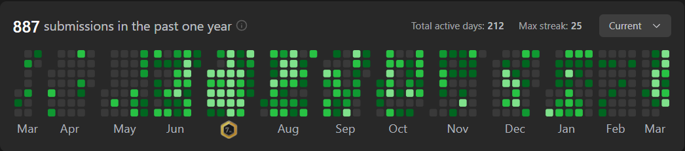

<h1 align="center">👋 Hey, I'm Harsh Yadav</h1>
<h3 align="center">Competitive Programmer | Backend Developer | AI Enthusiast</h3>

  

  

---

## 🧑‍💻 About Me

<pre>
name: Harsh Yadav
location: India
education: B.Tech @ IIIT Jabalpur
focus: Backend Development | DSA | AI Systems
currently_building: Scalable apps & AI-powered systems
</pre>

- 🏆 Competitive Programmer (LeetCode, CodeChef, Codeforces)  
- 💻 Backend Developer building production-ready applications  
- 🤖 Exploring Generative AI, LLMs & distributed systems  
- 🚀 Solved 750+ DSA problems (LeetCode 1600 | CodeChef Rank 50)  

---

## 🧠 Competitive Programming

### 📊 LeetCode Overview

  

### 🔥 Daily Submission Heatmap

  

  🔗 <a href="https://leetcode.com/u/harsshh_3/">Visit My LeetCode Profile</a>

---

## ⚡ Tech Stack

  

C++ • Python • JavaScript • TypeScript • Node.js • Express • React • Next.js • MongoDB • PostgreSQL • Redis • Docker • Git

---

## 🚀 Featured Projects

<table>
<tr>
<td width="50%">
<h3>🏥 QuickClinic</h3>

Healthcare system with RBAC, JWT auth, real-time features

<a href="https://quick-clinic-nine.vercel.app/">🔗 Live</a> |
<a href="https://github.com/harshsksh">💻 Code</a>

</td>

<td width="50%">
<h3>💸 SplitWise</h3>

Expense sharing app with optimal settlement logic

<a href="https://split-wise-two.vercel.app/login">🔗 Live</a> |
<a href="https://github.com/harshsksh">💻 Code</a>

</td>
</tr>

<tr>
<td width="50%">
<h3>🎓 ILoveCollege</h3>

Anonymous campus platform with real-time engagement

<a href="https://i-luv-college-1.vercel.app/">🔗 Live</a> |
<a href="https://github.com/harshsksh">💻 Code</a>

</td>

<td width="50%">
<h3>⚡ More Projects</h3>

Check pinned repositories 👇

</td>
</tr>
</table>

---

## 📊 GitHub Stats

  
  

---

## 📈 Contribution Graph

  

---

## 🤝 Connect with Me

---

⭐️ From <a href="https://github.com/harshsksh">Harsh Yadav</a>
